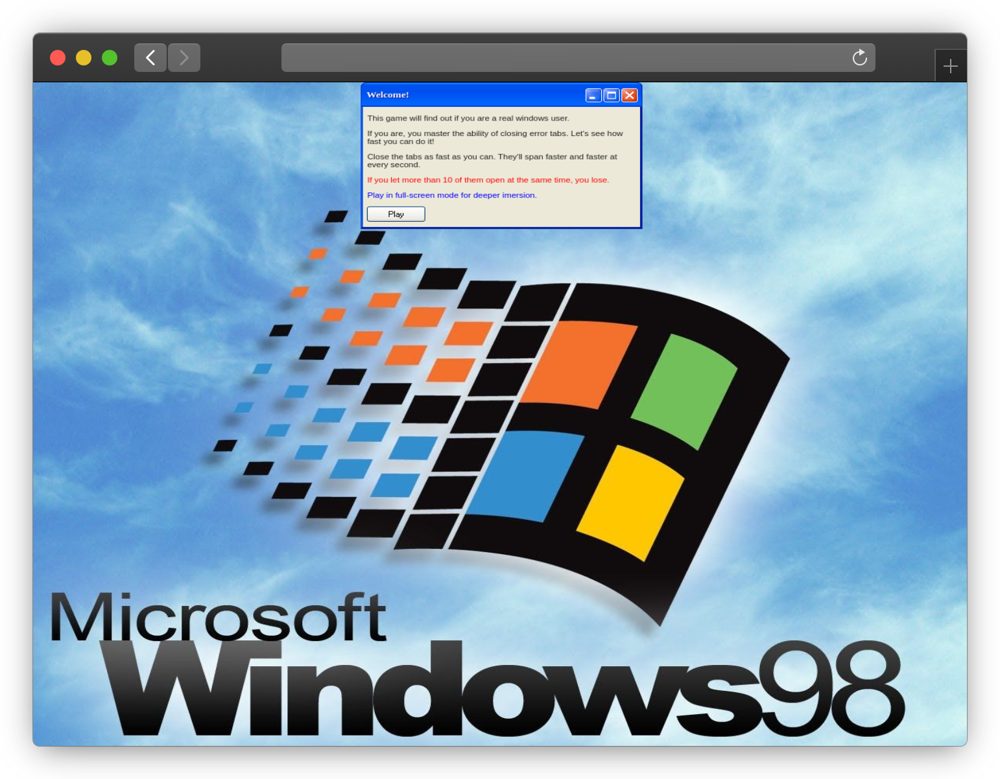

# XP, the game
Clicking game with the visual and spirit of Windows XP operational system developed using XP.css library.

## Getting Started
Just hit play in any browser.

## How to Play
* Your goal: close as many error tabs as you can.
* Your enemy: windows get faster and faster in producing errors at every second.
* Your score: increases the longer you survive.
* How you lose: if you let more than 10 tabs open at the same time, you're a terrible windows user.
* How you win: 💭

## Built With
This game was built for playing around with the CSS Library for emulating Windows XP GUI's from [@botoxparty](https://github.com/botoxparty).

You can check it out here: [XP.css](https://github.com/botoxparty/XP.css). Theres a Windows 98 library for the same purposes by [@jdan](https://github.com/jdan) here [98.css](https://github.com/jdan/98.css).

The rest it's just good and old `html` and `javascript`.

## Contribution
You can - and should - report any bug you encounter during the game to me - or maybe take them to you and help me solve them.

Pr's are 100% welcome.

Sharing your final score is also considered a contribution.

## Author
Hello, I'm Nicoly Dandara an odd mix of design and web development. I do a lot of useless, fun and visually appealing tools with what I know - this is just an example.

Hit me up:

## Acknowledgements
This is 100% fun project developed in the period of 8 hours, so, take it easy and have fun.

I'll be coming back soon for:
* Adding a live score.
* Addind the classic sound effect.
And maybe:
* Increase difficulty by making the error window move.

## License

[File](LICENSE.md)

---

